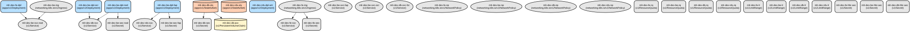

# My Little Recipe Book: A Secure Multi-Tier Kubernetes Application Platform

My Little Recipe Book (MLR) is a comprehensive recipe management platform deployed on Kubernetes that provides recipe storage, search, and recommendations through a secure microservices architecture. The platform integrates with multiple authentication providers and leverages OCR technology for recipe processing while ensuring high availability and scalability.

The platform consists of multiple specialized microservices including a Node.js backend for core functionality, a FastAPI service for recipe processing, an OCR service for image processing, and a Redis-based caching layer. It implements robust security measures through network policies, resource quotas, and secure secret management while providing seamless integration with OAuth providers like Google, Kakao, and Naver.

## Repository Structure
```
kubernetes/
├── Namespace Configuration
│   ├── 01-Namespace.yaml           # Defines frontend, backend, and database namespaces
│   └── 01-redis-ns.yaml           # Defines Redis namespace
├── Core Configuration
│   ├── 02-Configmap.yaml          # Application configuration for frontend and backend services
│   ├── 02-cm-rds.yaml            # Redis configuration
│   └── 03-Secret.yaml            # Sensitive data storage (API keys, credentials)
├── Storage Configuration
│   └── 04-PV-PVC.yaml            # Persistent volume configuration for database
├── Security
│   ├── 05-SA.yaml                # Service account configuration
│   ├── 06-Role.yaml              # RBAC role definitions
│   ├── 07-RoleBinding.yaml       # RBAC role bindings
│   └── 14-Netpol.yaml           # Network policies for service isolation
├── Service Definitions
│   ├── 08-Ingress.yaml           # External access configuration
│   └── 09-Service.yaml           # Internal service endpoints
├── Workload Definitions
│   ├── be_fap_deployment.yaml    # FastAPI backend deployment
│   ├── be_nod_deployment.yaml    # Node.js backend deployment
│   ├── be_ocr_deployment.yaml    # OCR service deployment
│   ├── db_statefulset.yaml      # Database StatefulSet
│   └── fe_deployment.yaml        # Frontend deployment
└── Resource Management
    ├── 12-HPA.yaml               # Horizontal Pod Autoscaling configuration
    ├── 13-LimitRage.yaml         # Container resource constraints
    └── 15-ResourceQuota.yaml     # Namespace resource quotas
```

## Usage Instructions
### Prerequisites
- Kubernetes cluster v1.20+
- kubectl CLI tool
- Helm v3+ (optional, for package management)
- Access to container registry (192.168.56.200)
- SSL certificates for TLS termination
- Storage provisioner supporting ReadWriteOnce access mode

### Installation

1. Create required namespaces:
```bash
kubectl apply -f 01-Namespace.yaml
kubectl apply -f 01-redis-ns.yaml
```

2. Apply configurations:
```bash
kubectl apply -f 02-Configmap.yaml
kubectl apply -f 02-cm-rds.yaml
kubectl apply -f 03-Secret.yaml
```

3. Setup storage:
```bash
kubectl apply -f 04-PV-PVC.yaml
```

4. Configure security:
```bash
kubectl apply -f 05-SA.yaml
kubectl apply -f 06-Role.yaml
kubectl apply -f 07-RoleBinding.yaml
kubectl apply -f 14-Netpol.yaml
```

5. Deploy services:
```bash
kubectl apply -f 08-Ingress.yaml
kubectl apply -f 09-Service.yaml
```

6. Deploy applications:
```bash
kubectl apply -f be_fap_deployment.yaml
kubectl apply -f be_nod_deployment.yaml
kubectl apply -f be_ocr_deployment.yaml
kubectl apply -f db_statefulset.yaml
kubectl apply -f fe_deployment.yaml
```

7. Configure resource management:
```bash
kubectl apply -f 12-HPA.yaml
kubectl apply -f 13-LimitRage.yaml
kubectl apply -f 15-ResourceQuota.yaml
```

### Troubleshooting

Common issues and solutions:

1. Pod Startup Issues
```bash
# Check pod status
kubectl get pods -n mlr-dev-be-ns
# View pod logs
kubectl logs -f <pod-name> -n mlr-dev-be-ns
```

2. Database Connection Issues
```bash
# Verify database service
kubectl get svc -n mlr-dev-db-ns
# Check database logs
kubectl logs -f -l app=mysql -n mlr-dev-db-ns
```

3. Network Policy Issues
```bash
# Verify network policies
kubectl get networkpolicies --all-namespaces
# Describe specific policy
kubectl describe networkpolicy mlr-dev-be-np -n mlr-dev-be-ns
```

## Data Flow
The application follows a multi-tier architecture where requests flow from the frontend through various backend services to the database and cache layers.

```ascii
External -> Ingress -> Frontend -> Backend Services -> Database/Redis
                         |              |
                         |              ├─> Node.js API (Auth/Core)
                         |              ├─> FastAPI (Recipe Processing)
                         └─────────────>└─> OCR Service (Image Processing)
```

Key component interactions:
1. Frontend communicates with backend services through defined service endpoints
2. Backend services authenticate through OAuth providers (Google, Kakao, Naver)
3. FastAPI service processes recipe data and interfaces with Redis cache
4. OCR service handles image processing and text extraction
5. All services follow strict network policies for secure communication
6. Database access is restricted to backend services only
7. Redis provides caching layer for improved performance

## Infrastructure



Lambda Functions:
- `mlr-dev-be-dpl-nod`: Node.js backend deployment (CPU: 200m-600m, Memory: 128Mi-512Mi)
- `mlr-dev-be-dpl-fap`: FastAPI backend deployment (CPU: 150m-400m, Memory: 96Mi-192Mi)
- `mlr-dev-be-dpl-ocr`: OCR service deployment (CPU: 200m-800m, Memory: 384Mi-1Gi)

Database:
- StatefulSet: MySQL database with persistent storage
- Redis: Sentinel-managed Redis cluster for caching

Network:
- Ingress: NGINX ingress controller with SSL termination
- Network Policies: Strict network isolation between services
- Services: ClusterIP and NodePort service types

Resource Management:
- HPA: Automatic scaling based on CPU/Memory metrics
- Resource Quotas: Namespace-level resource limits
- LimitRange: Container-level resource constraints